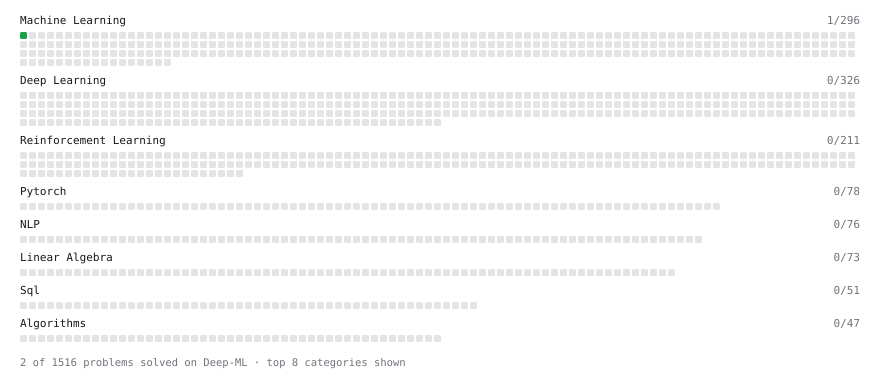

# Deep-ML

My machine learning practice from [Deep-ML](https://www.deep-ml.com). Every solution here was written by hand.

**7** solved · 0 problems · 0 labs · 7 math

[**Browse the interactive portfolio**](https://K4yb3r.github.io/deep-ml/) to replay this filling in over time.

## Math

| | Difficulty | Solved | |
| --- | --- | --- | --- |
| [Derivatives and Gradients](https://www.deep-ml.com/math-problems/1) | easy | 2026-10-01 | [solution](math/0001-derivatives-and-gradients) |
| [Matrix Basics](https://www.deep-ml.com/math-problems/9) | easy | 2026-09-17 | [solution](math/0009-matrix-basics) |
| [Vector Operations](https://www.deep-ml.com/math-problems/7) | easy | 2026-09-17 | [solution](math/0007-vector-operations) |
| [Inverse and Rank](https://www.deep-ml.com/math-problems/12) | medium | 2026-09-17 | [solution](math/0012-inverse-and-rank) |
| [Matrix Multiplication](https://www.deep-ml.com/math-problems/10) | medium | 2026-09-17 | [solution](math/0010-matrix-multiplication) |
| [Solving Linear Systems](https://www.deep-ml.com/math-problems/13) | medium | 2026-09-17 | [solution](math/0013-solving-linear-systems) |
| [Vector Norms and Linear Independence](https://www.deep-ml.com/math-problems/8) | medium | 2026-09-17 | [solution](math/0008-vector-norms-and-linear-independence) |

---

_This file is regenerated by Deep-ML on every push._
